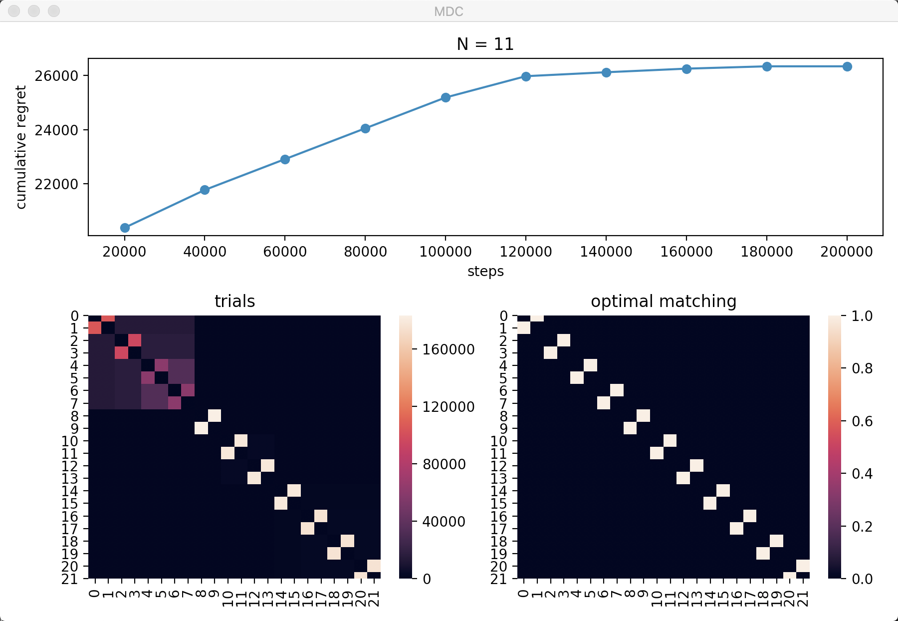

# Matching bandit

## List of algorithms in the experiments section


|    |      Pair selection      |  Matching selection |
|----------|:-------------:|------:|
| Regret minimisation |  __STOA__: `Rank1Elim` in [Katariya et al 2017](http://proceedings.mlr.press/v54/katariya17a.html); __Ours__: `Pair1Elim` |  __STOA__: `ESCB` in [Combes et al 2015](https://dl.acm.org/doi/10.5555/2969442.2969476) ; __Ours__: `MATCHING DIVIDE CONQUER`|

## Installation

After downloading the source code, install the dependencies with:

```bash
cd matching-bandit
pip install -e .
```

## Basic Usage

You can test the environment by running the `SIMPLE-ADAPTIVE-MATCHING` agents:

```bash
python matching_bandit/agents/simple_adaptive_matching.py --n_pairs 11 --Delta 0.1 --horizon 200000
```

The code will generate a `MatchingSelectionBandit` environment with 11 pairs of items and demonstrate the performance of the `SIMPLE-ADAPTIVE-MATCHING` algorithm. The simulation will last 200000 iterations (horizon).

A window will be opened and show the agent's performance and the environment's state:

